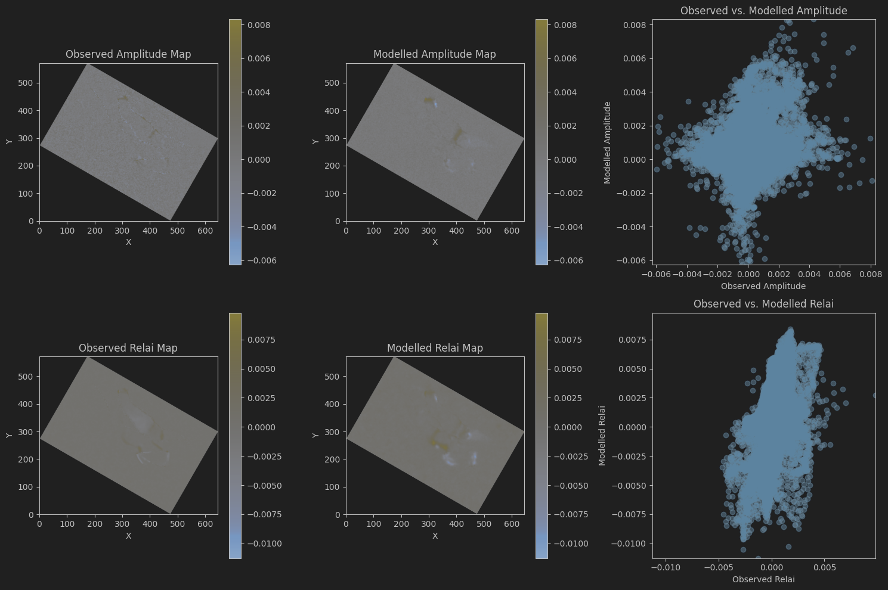

# QC using Jupyter Notebooks

Jupyter Notebooks are very versatile tools for QC'ing `sim2seis` results. The resulting cubes and attribute maps can
easily be read into a notebook using `xtgeo`. A simple example is shown below, where two amplitude maps and two
relative AI maps are compared, both visually and in cross plots.

```python
# Import modules
import xtgeo
import matplotlib.pyplot as plt
import os

# Set up parameters
project_dir = r"/scratch/fmu/hfle/fmu_sim2seis/realization-0/iter-0"
rel_dir_obs_maps = r"share/observations/maps"
rel_dir_mod_maps = r"share/results/maps"

obs_amplitude_map = "topvolantis--amplitude_mean_depth--20180701_20180101.gri"
obs_relai_map = "topvolantis--relai_mean_depth--20180701_20180101.gri"

mod_amplitude_map = "topvolantis--amplitude_full_mean_depth--20180701_20180101.gri"
mod_relai_map = "topvolantis--relai_full_mean_depth--20180701_20180101.gri"


# Import data
os.chdir(project_dir + os.path.sep + rel_dir_obs_maps)
obs_maps = {
    'amp': xtgeo.surface.surface_from_file(obs_amplitude_map, fformat='irap_binary'),
    'relai': xtgeo.surface.surface_from_file(obs_relai_map, fformat='irap_binary'),
}

os.chdir(project_dir + os.path.sep + rel_dir_mod_maps)
mod_maps = {
    'amp': xtgeo.surface.surface_from_file(mod_amplitude_map, fformat='irap_binary'),
    'relai': xtgeo.surface.surface_from_file(mod_relai_map, fformat='irap_binary'),
}


# Plot data
# Calculate the value range for amplitude
amp_min = min(obs_maps['amp'].values.min(), mod_maps['amp'].values.min())
amp_max = max(obs_maps['amp'].values.max(), mod_maps['amp'].values.max())

# Calculate the value range for relai
relai_min = min(obs_maps['relai'].values.min(), mod_maps['relai'].values.min())
relai_max = max(obs_maps['relai'].values.max(), mod_maps['relai'].values.max())

# Create a figure with 2 rows and 3 columns
fig, axes = plt.subplots(2, 3, figsize=(15, 10))

# Plot observed amplitude map in the first column, first row
im1 = axes[0, 0].imshow(obs_maps['amp'].values, cmap='cividis', origin='lower', vmin=amp_min, vmax=amp_max)
axes[0, 0].set_title('Observed Amplitude Map')
axes[0, 0].set_xlabel('X')
axes[0, 0].set_ylabel('Y')
fig.colorbar(im1, ax=axes[0, 0])

# Plot modelled amplitude map in the second column, first row
im2 = axes[0, 1].imshow(mod_maps['amp'].values, cmap='cividis', origin='lower', vmin=amp_min, vmax=amp_max)
axes[0, 1].set_title('Modelled Amplitude Map')
axes[0, 1].set_xlabel('X')
axes[0, 1].set_ylabel('Y')
fig.colorbar(im2, ax=axes[0, 1])

# Scatterplot of observed vs. modelled amplitude in the third column, first row
axes[0, 2].scatter(obs_maps['amp'].values.flatten(), mod_maps['amp'].values.flatten(), alpha=0.5)
axes[0, 2].set_title('Observed vs. Modelled Amplitude')
axes[0, 2].set_xlabel('Observed Amplitude')
axes[0, 2].set_ylabel('Modelled Amplitude')
axes[0, 2].set_xlim(amp_min, amp_max)
axes[0, 2].set_ylim(amp_min, amp_max)

# Plot observed relai map in the first column, second row
im3 = axes[1, 0].imshow(obs_maps['relai'].values, cmap='cividis', origin='lower', vmin=relai_min, vmax=relai_max)
axes[1, 0].set_title('Observed Relai Map')
axes[1, 0].set_xlabel('X')
axes[1, 0].set_ylabel('Y')
fig.colorbar(im3, ax=axes[1, 0])

# Plot modelled relai map in the second column, second row
im4 = axes[1, 1].imshow(mod_maps['relai'].values, cmap='cividis', origin='lower', vmin=relai_min, vmax=relai_max)
axes[1, 1].set_title('Modelled Relai Map')
axes[1, 1].set_xlabel('X')
axes[1, 1].set_ylabel('Y')
fig.colorbar(im4, ax=axes[1, 1])

# Scatterplot of observed vs. modelled relai in the third column, second row
axes[1, 2].scatter(obs_maps['relai'].values.flatten(), mod_maps['relai'].values.flatten(), alpha=0.5)
axes[1, 2].set_title('Observed vs. Modelled Relai')
axes[1, 2].set_xlabel('Observed Relai')
axes[1, 2].set_ylabel('Modelled Relai')
axes[1, 2].set_xlim(relai_min, relai_max)
axes[1, 2].set_ylim(relai_min, relai_max)

# Adjust layout
plt.tight_layout()
plt.show()
```


