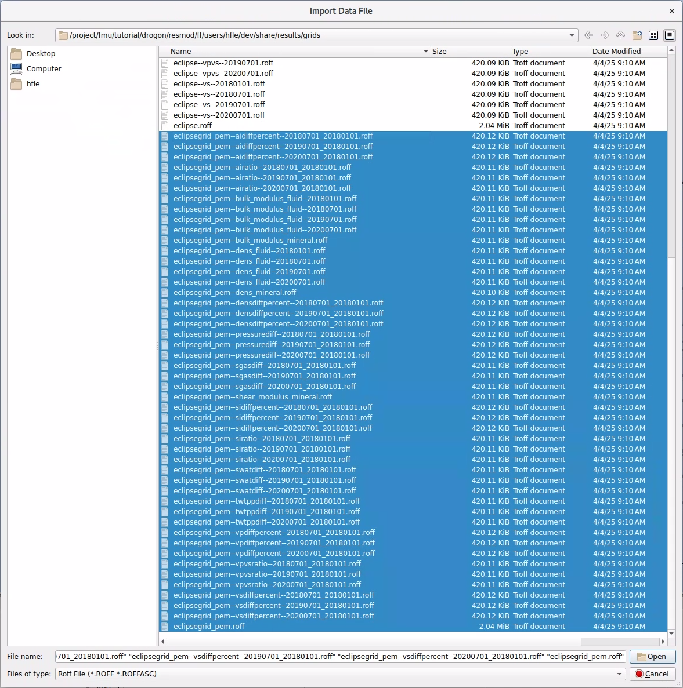
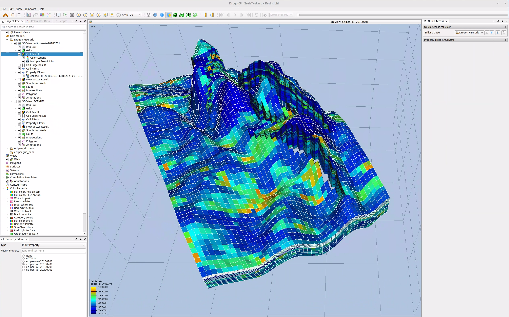
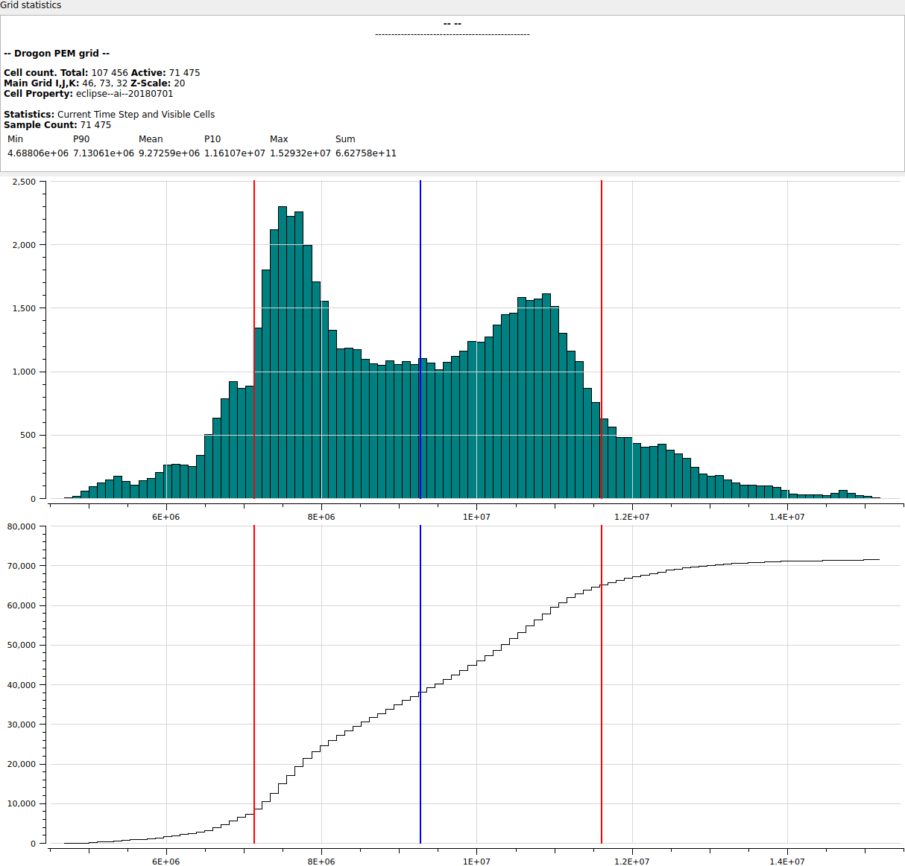
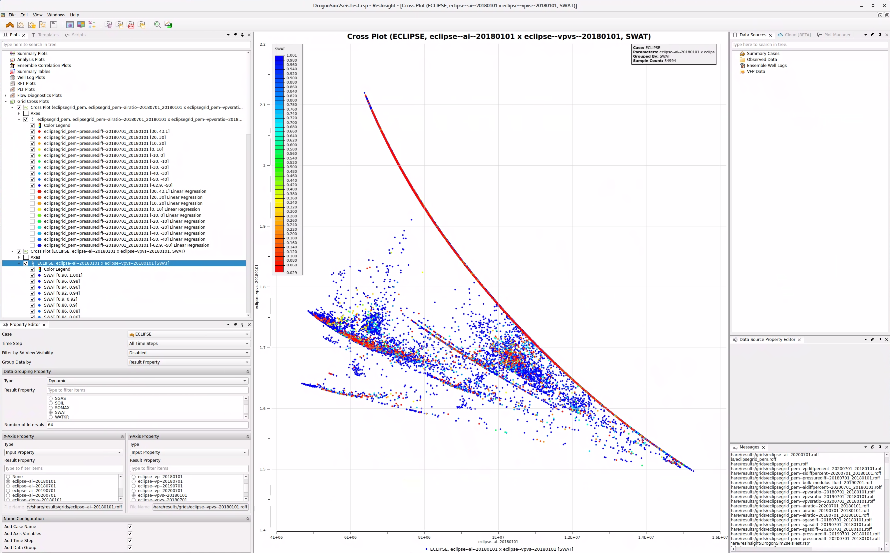
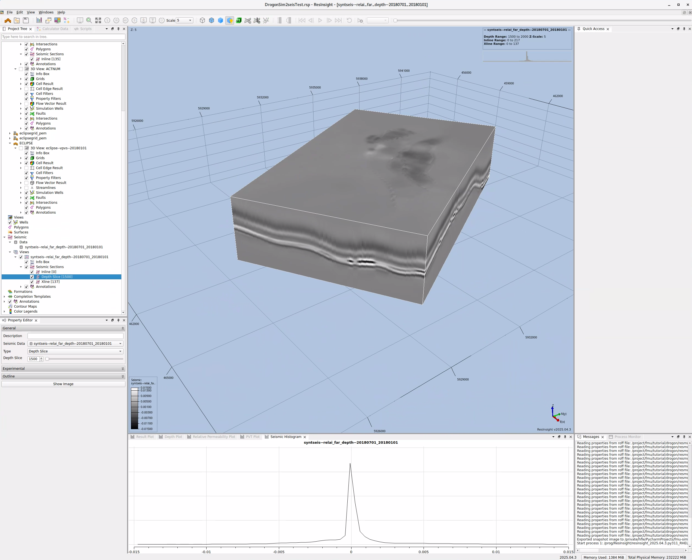
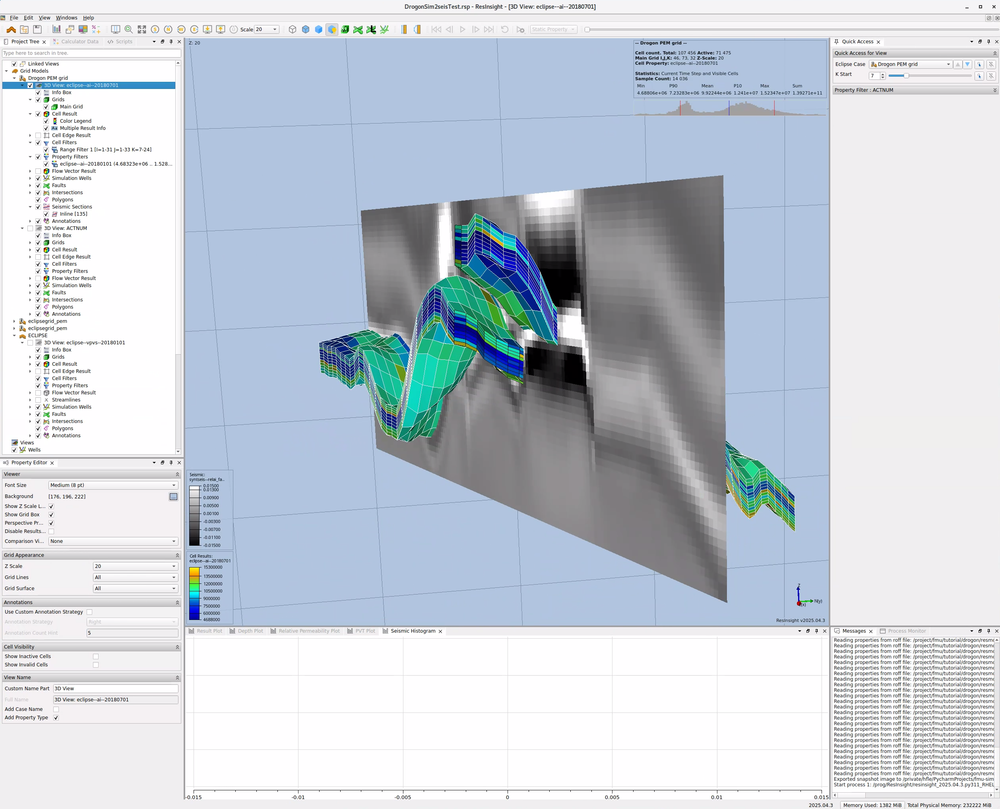

# QC in ResInsight

**ResInsight** is an open-source reservoir analysis application for 3D visualisation and post-processing of reservoir
models. It can be used for QC of grids from `pem` and seismic cubes from `sim2seis`. At present, there is no file format
for attribute maps and horizons that are common to both `xtgeo` and ResInsight.

## Grids in ResInsight

### Grid Import in ResInsight

It is possible to import grids and grid properties in `.roff` format. Grids and grid properties can be imported into a
ResInsight project in one operation, or the grid properties can be added after the grid is imported.

Eclipse simulation runs can also be used to define the grid, and the results from `pem` can be added as properties. This
enables cross-plotting of static and dynamic properties that are input to `pem` with `pem` results, allowing
verification of their expected relationships.

`File => Import => Roff Grid Models => Import ROFF Case`

**Figure 1:** Import of grid and grid properties to ResInsight.

### Grid Visualisation

3D visualisation of grid properties is available once the grid and properties are loaded. A 3D view is set up by
default, and it can be modified through the *Property Editor*. In the **3D View** properties under the grid, the
selection of which property to display is done via the **Cell Result** property. Other properties can be explored, such
as colour legends, property filters, annotations, etc.

**Figure 2:** 3D view of AI property.

### Grid Analysis

There are multiple options for grid analysis in ResInsight. Cross-plots between grid properties, i.e. results from `pem`
can be combined with `eclipse` `init` or `unrst` (static or dynamic) properties. Cross-plots are part of the Plot
Window options in ResInsight. Histogram of grids and cumulative histogram can be found in either the Plot Window, or
as a right-click option in the 3D display background.

**Figure 3:** Grid histogram is available as a right-click option in 3D view.

**Figure 4:** Cross-plot with Vp/Vs plotted against AI, with colour coding by water saturation.

## Cubes in ResInsight

Segy cubes must be imported one at a time to ResInsight. Cubes can be visualised on their own or with well data
through Seismic View, but more interesting will be to combine the seismic cubes with grid properties through Seismic
Section. There are currently no particular options for analysis of seismic data, except for histogram.

**Figure 5:** Seismic cube can be visualised with inline, crossline or timeslice.

**Figure 6:** Grid property combined with a seismic section.
