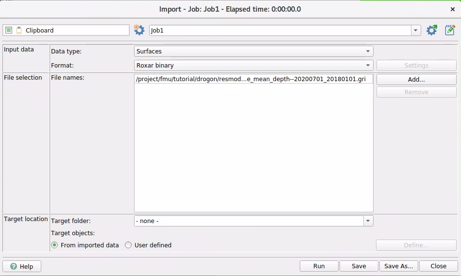

# QC using RMS
Even if `sim2seis` is not connected to `RMS` anymore, the results can of course be validated within `RMS` if the 
application is available. 

The results from `sim2seis` are attribute maps, seismic cubes and grid properties from `pem`. All of these data types
can be imported into RMS for visual inspection and further analysis. The standard procedure is to import the data items
using the RMS import menus, but an alternative is to create Python scripts that utilise the functionality of `xtgeo`.

### Seismic Cubes
Seismic amplitude and relative acoustic impedance cubes are saved to disk in `.segy` format. In the `sim2seis` workflow,
the end results are typically difference data between two vintages of modelled seismic. The file name will contain
information about which dates are the seismic base and monitor. As the seismic cubes can have time or depth as the third
dimension, this information must be provided when cubes are imported into RMS.


<span id="figure-1-cube-import"><strong>Figure 1:</strong> User dialog for cube import in RMS.</span>

<br><br>


<span id="figure-2-cube-format"><strong>Figure 2:</strong> RMS scans for segy format and sets parameter positions.</span>

<br><br>


<span id="figure-3-cube-display"><strong>Figure 3:</strong> Visualise the cube using RMS 3D view.</span>

<br><br>
All file formats saved from a `sim2seis` run are recognised by RMS, but instead of manual import, it might be easier to
use a Python script and the `xtgeo` module for import. The example below is intended for running within an RMS session:

### Amplitude maps
The user dialog is the same for importing to `clipboard` or a horizon folder in the Project data tree. **NB!** 
attributes with low numerical values are not handled particularly well by RMS, so it might be an advantage to 
scale values, e.g. to the thousands range.


<span id="figure-4-map-import"><strong>Figure 4:</strong> Attribute map import to clipboard.</span>
<br><br>


<span id="figure-5-map-display"><strong>Figure 5:</strong> Visualise the attribute map. Low numerical values make the value readout insensitive.</span>
<br><br>

To improve the readout of values, it is possible to scale the values in the attribute map. This can be done by multiplying the values by a factor of 1 000 000, for example. This will make the readout more accurate in the map view.


<span id="figure-6-map-display"><strong>Figure 6:</strong> Boosting the values by a factor of 1 000 000 makes exact value readout more accurate.</span>


### Grid Property from `PEM`
The grid model that the pem properties are imported to must exist before property import. Binary `roff` format is
used for grid import. Grids are best visualised in the 3D view.


<span id="figure-7-cube-import"><strong>Figure 7:</strong> User dialog for grid import in RMS.</span>
<br><br>


<span id="figure-8-cube-import"><strong>Figure 8:</strong> Grid visualisation using 3D view.</span>

### Python Import Script using `xtgeo`
Below is a Python script that illustrates how the `xtgeo` functionality can be used to read cube, grid and attribute map
objects from file and save them to an RMS project. Note that some folders or grid models must be defined prior to 
running the `.to_roxar(...)` commands

```python
# Import modules
import xtgeo
import os

# Reference to 'magic' project property
PRJ = project

# Directory setup
project_dir = r"/scratch/fmu/hfle/fmu_sim2seis/realization-0/iter-0"
rel_dir_obs_maps = r"share/observations/maps"
rel_dir_mod_cubes = r"share/results/cubes"
rel_dir_mod_grid = r"share/results/grids"

# Grid property import from PEM. NB! Grid model must exist before import
os.chdir(project_dir + os.path.sep + rel_dir_mod_grid)
pem_grid_name = "Eclipsegrid_pem"
pem_grid_prop_ai_name = "eclipsegrid_pem--airatio--20180701_20180101.roff"
pem_ai = xtgeo.gridproperty_from_file(pem_grid_prop_ai_name, fformat="roff")
pem_ai.to_roxar(projectname=PRJ, gridname=pem_grid_name, propertyname=pem_grid_prop_ai_name[:-4])

# Cube import
os.chdir(project_dir + os.path.sep + rel_dir_mod_cubes)
mod_amp_cube = "syntseis--amplitude_full_depth--20180701_20180101.segy"
cube_amp = xtgeo.cube.cube_from_file(mod_amp_cube)
cube_amp.to_roxar(project=PRJ, name=mod_amp_cube[:-4], domain="depth")

# Map import example. NB! Note that both name and category must be defined in 
# the RMS project prior to importing the map
os.chdir(project_dir + os.path.sep + rel_dir_obs_maps)
obs_relai_map = "topvolantis--relai_mean_depth--20180701_20180101.gri"
srf_ai = xtgeo.surface.surface_from_file(obs_relai_map, fformat='irap_binary')
srf_ai.to_roxar(project=PRJ, name="TopVolantis--relai--20180701-20180101", category="RelAi")
```
